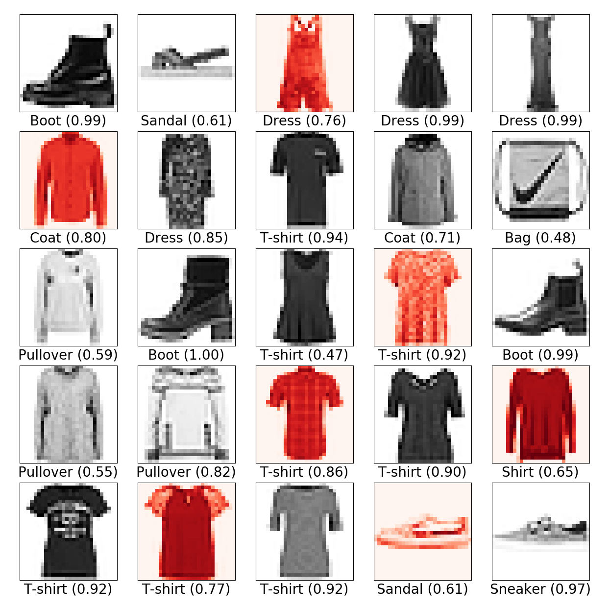
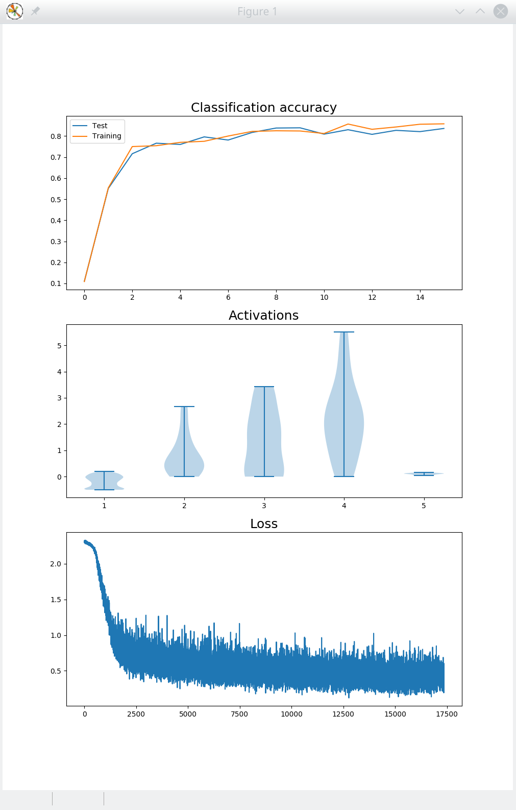

# Coursework1
This is the coursework1 for Neural Computation 2020

### 06-32167 & 06-32212 Neural Computation (Extended) 

# CW1: Backpropagation and Softmax

Released: November 2nd, 2020 Deadline: November 20th at 5pm, 2020. Weight: 25 %

Figure 1: Visualisation of training examples from the Fashion MNIST dataset and examples of predicted classes (with probabilities in parentheses). Incorrect classications are highlighted in red.

You should complete this coursework in groups as specied on Canvas. To account for dierent contributions between group members, we will ask for a peer evaluation on Canvas at the end of the coursework. The individual marks will be adjusted in the interval [{5%,5%] (out of a total mark of 25%) based on this evaluation. Discrepancies and anomalies in the peer evaluation will be considered on a case-by-case basis.

Each group should make one submission consisting of one tarball cw1-2020-files.tar.gz. The contents of the tarball should be one directory cw1-2020-files containing your comple- tion of the provided Python les (see below) and a report in PDF le format with the le name report.pdf. To facilitate automated assessment, you should not change the function names or function signatures in the provided le backprop-softmax.py.

Each student should also submit a separate Canvas assignment with a description of their own contribution to the project (no more than 100 words), and the peer evaluation. This assignment is not marked, but will be used to determine peer marking for the coursework.

1<https://github.com/zalandoresearch/fashion-mnist>

1<https://github.com/zalandoresearch/fashion-mnist>. [The](#_page0_x107.04_y639.97) dataset consists

of a training set of 60,000 examples and a test set of 10,000 examples. Each example is a 28x28 grayscale image, associated with one of 10 labels (t-shirt, trouser, etc.), as shown in Figure 1.

To train the network, we will implement the backpropagation algorithm and mini-batch gradient descent. The pseudo-code of the algorithms are provided in the lectures notes on Backpropagation

and Softmax. A skeleton implementation together with some utility functions for reading and plotting data are provided as a tarball le cw1-2020-files.tar.gz on Canvas. The tarball also contains the dataset, hence you do not need to download this separately.

To complete the coursework, you should use the Numpy and Matplolib in Python 3. For coursework 1, you should not use any neural network library which provides autograd functionality, such as PyTorch or TensorFlow.

# Task 1 (1 %). Extend the code by implementing the softmax function which computes a probability

vector (p1;:::;p10) from the 10 activation units z1L;:::;z10 in the softmax layer.

L

Input argument:

- a vector z = ( zL;:::;zL ) corresponding to the z units in the softmax layer 1 10

Output:

- the probability vector (p ;:::;p ) in the output layer

1 10

Example:

In the following example, we rst instantiate an object of the BackPropagation class (which causes the dataset to be loaded), and then call the softmax function with a simple test vector.

\>>> bp = BackPropagation()

Extracting fashion-mnist/data/fashion/train-images-idx3-ubyte.gz

Extracting fashion-mnist/data/fashion/train-labels-idx1-ubyte.gz

Extracting fashion-mnist/data/fashion/t10k-images-idx3-ubyte.gz

Extracting fashion-mnist/data/fashion/t10k-labels-idx1-ubyte.gz

\>>> z = np.array([0,1,2,3,4,5,6,7,8,9])

\>>> bp.softmax(z)

array([7.80134161e-05, 2.12062451e-04, 5.76445508e-04, 1.56694135e-03,

4.25938820e-03, 1.15782175e-02, 3.14728583e-02, 8.55520989e-02, 2.32554716e-01, 6.32149258e-01])

# Task 2 (3 %). Extend the code by implementing the forward function which sets the activation units in the input layer to an input image x, then feeds forward the data through the network, and nally returns the probability vector corresponding to the 10 probability units in the output layer.

Input arguments:

- x 2 [1;1]784 the image as a vector of 784 elements

Output:

- the probability vector (p ;:::;p ) in the output layer 1 10

Example:

Here, we call the forward function with the rst image in the training set as input. Depending on the current weights and biases in your network, you may see a dierent output than the probability vector below.

\>>> bp.forward(bp.trainX[0])

array([0.10425727, 0.09743926, 0.0998025 , 0.09768295, 0.1084072 ,

0.09732901, 0.08471379, 0.09933064, 0.09877855, 0.11225882])

# Task 3 (1 %). We used the maximum likelihood principle to derive a loss function

C(i) := logp (i);

y

where pj 2 [0;1] is the network's predicted probability of class j, and y(i) 2 f1;:::;10g is the correct class for the i-th training item. Implement the softmax loss function called loss in the provided le backprop-softmax.py.

Input argument:

- a vector pred = ( p1;:::;pm ) corresponding to the 10 probability units in the output layer
- y 2 f 0;1g10 a \one-hot encoding" of the correct class of the image. E.g., if the rst class is correct, vector y is (1,0,0,0,0,0,0,0,0,0). Hint: Use np.argmax(y) to obtain the class index from the one-hot encoded vector.

Output:

- the loss value

Example:

We forward data from the rst image, then compute the loss. The loss values may depend on the state of your network.

\>>> bp.forward(bp.trainX[0])

array([0.09371258, 0.10556965, 0.09432195, 0.10503915, 0.12660278,

0.10768817, 0.08212865, 0.10272175, 0.07511968, 0.10709562]) >>> bp.loss(bp.a[bp.L-1], bp.trainY[0])

2.0667007822344643

# Task 4 (5 %). Extend the code by implementing the backward function which rst computes the local gradients self.delta[l] for each layer in the network, then evaluates the partial derivatives of the cost relative to the weights self.dw[l] and the biases self.db[l] for each layer in the network.

Before the backward function is called, you can assume that the forward function has been called with an appropriate input vector x.

Input arguments:

- y 2 f 0;1g10 a \one-hot encoding" of the correct class of the image. E.g., if the rst class is correct, vector y is (1,0,0,0,0,0,0,0,0,0).

Output:

- the \function" produces no output

Example:

Here, we rst inspect the partial derivatives in a given layer, e.g. layer 1, to check that they have been initialised to 0. We then call the the forward function with the rst image in training set as input, and then the backward function with the corresponding label of the corresponding training example. Finally, we notice that the partial derivatives have been updated by the backward function.

\>>> bp.dw[1]

array([[0., 0., 0., ..., 0., 0., 0.],

[0., 0., 0., ..., 0., 0., 0.],

[0., 0., 0., ..., 0., 0., 0.],

...,

[0., 0., 0., ..., 0., 0., 0.],

[0., 0., 0., ..., 0., 0., 0.],

[0., 0., 0., ..., 0., 0., 0.]])

\>>> bp.forward(bp.trainX[0])

array([0.0967909 , 0.07826556, 0.11721793, 0.10145362, 0.09939592,

0.10454699, 0.11850906, 0.09381184, 0.09803316, 0.09197501]) >>> bp.backward(bp.trainY[0])

\>>> bp.dw[1]

array([[ 0. , 0. , 0. , ..., 0. ,

\0. , 0. ],

[-0.00243765, -0.00243765, -0.00243765, ..., -0.00243765,

-0.00243765, -0.00243765],

[-0.02531953, -0.02531953, -0.02531953, ..., -0.02531953,

-0.02531953, -0.02531953],

...,

[ 0. , 0. , 0. , ..., 0. ,

[ 0. , 0. , 0. , ..., 0. ,

\0. , 0. ]])

# Task 5 (5 %). Complete the code in backprop-softmax.py by implementing the places marked TODO.

Example:

We launch the code from the command line

[pkl@phi backprop]$ python3 backprop-softmax.py

Extracting fashion-mnist/data/fashion/train-images-idx3-ubyte.gz Extracting fashion-mnist/data/fashion/train-labels-idx1-ubyte.gz Extracting fashion-mnist/data/fashion/t10k-images-idx3-ubyte.gz Extracting fashion-mnist/data/fashion/t10k-labels-idx1-ubyte.gz

# Task 6 (10 %). Design a set of experiments to investigate how the following hyper-parameters aect classi cation accuracy: training time, learning rate, minibatch size, network topology, and activation function.

What is the best classication accuracy you can achieve on the test data? Summarise your ndings in a report of at most 5 pages (A4 page, 11pt font). The report should clearly state the experiments you have carried out, including the method, the results, and your interpretation of the results.
PAGE5
